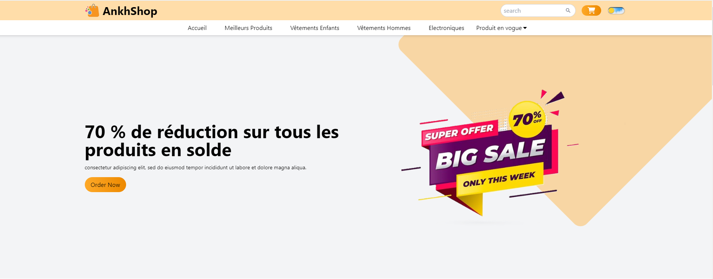

# Site E-Commerce avec React.js et Tailwind CSS

Bienvenue sur notre site E-Commerce développé avec React.js et Tailwind CSS ! Ce README fournit un aperçu de notre projet, de ses fonctionnalités, ainsi que des instructions pour commencer.

## Aperçu

Notre site E-Commerce est conçu pour offrir aux utilisateurs une expérience de shopping fluide. Il propose une variété de produits dans différentes catégories, permettant aux utilisateurs de naviguer, rechercher et acheter des articles facilement. Le site est développé avec React.js, une bibliothèque JavaScript populaire pour la création d'interfaces utilisateur, et Tailwind CSS, un framework CSS utilitaire.

## Fonctionnalités

- **Catalogue de Produits :** Parcourez une large gamme de produits avec des descriptions détaillées et des images.
- **Fonctionnalité de Recherche :** Recherchez facilement des produits en utilisant des mots-clés ou des catégories.
- **Panier d'Achat :** Ajoutez des articles au panier d'achat, mettez à jour les quantités et procédez au paiement.
- **Design Réactif :** Le site est entièrement réactif et optimisé pour différentes tailles d'écrans et appareils.

## Technologies Utilisées

- React.js : Une bibliothèque JavaScript pour la création d'interfaces utilisateur.
- Tailwind CSS : Un framework CSS utilitaire pour la conception de composants d'interface utilisateur réactifs et personnalisables.
- React Router : Pour la gestion de la navigation et des routes au sein de l'application.

## Pour Commencer

Pour exécuter le site E-Commerce en local, suivez ces étapes :

1. Clonez le dépôt sur votre machine locale :

<code>git clone https://github.com/machia-codeur/site-e-commerce.git</code>

2. Accédez au répertoire du projet :

<code>cd site-e-commerce</code>

3. Installez les dépendances à l'aide de npm ou yarn :

<code>npm install</code> 
            ou  
<code>yarn install</code>

4. Démarrez le serveur de développement :

<code>npm run dev</code> 
            ou  
<code>yarn run dev</code> 

5. Ouvrez votre navigateur web et visitez [http://localhost:5173/](http://localhost:5173/) pour afficher le site.

## Contribution

Nous accueillons les contributions de la communauté ! Si vous trouvez des bugs, avez des demandes de fonctionnalités ou souhaitez contribuer au code, n'hésitez pas à ouvrir une issue ou à soumettre une pull request.

## Contact

Pour toute question ou retour d'expérience, veuillez nous contacter à [popoin61@gmail.com](mailto:popoin61@gmail.com).

Merci d'utiliser notre site E-Commerce ! Nous espérons que vous apprécierez votre expérience de shopping.

